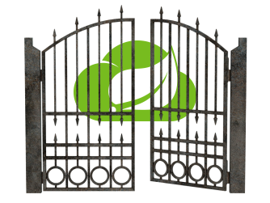

[![Build Status][travis-badge]][travis-badge-url]
[![Quality Gate][sonarqube-badge]][sonarqube-badge-url] 
[![Technical debt ratio][technical-debt-ratio-badge]][technical-debt-ratio-badge-url] 
[![Coverage][coverage-badge]][coverage-badge-url]


 
Spring Cloud Gateway Example 
==============================
This project is example of using [Spring Cloud Gateway](https://spring.io/projects/spring-cloud-gateway) as an edge 
service with a Spring Boot application. Spring Cloud Gateway provides means for routing an incoming request to a 
matching downstream service.

Gateway is a suitable replacement for [Spring Cloud Netflix Zuul](https://spring.io/projects/spring-cloud-netflix) since 
the latter module is now in maintenance mode starting Spring Cloud Greenwich (2.1.0) release train. Spring Cloud will 
continue to support Zuul for a period of at least a year from the general availability of the Greenwich release train. 
Putting a module in the maintenance mode means that the Spring Cloud will no longer add any new feature but will fix 
blocker bugs and security issues.

## Introduction
  - A **route** is the fundamental concept of Spring Cloud Gateway framework. A route contains a destination URL and a
collection of predicates and filters. An request is forwarded to a route if the result of logical _AND_ operation on 
all its predicates is _true_.

  - A **predicate** is boolean valued function.
  
  - A **filter** provides a way of modifying requests and responses.

### A Route Example
Here's a simple route example used in this project,

```yaml
spring:
  cloud:
    gateway:
      routes:
        - id: book-id
          uri: http://localhost:8080
          predicates:
            - Path=/books/**
          filters:
            - PrefixPath=/public
            - AddRequestHeader=X-Request-Foo, Bar
            - AddRequestTimeHeaderPreFilter
            - AddResponseHeader=X-Response-Bye, Bye
            - AddResponseTimeHeaderPostFilter
```


[travis-badge]: https://travis-ci.org/indrabasak/spring-gateway-example.svg?branch=master
[travis-badge-url]: https://travis-ci.org/indrabasak/spring-gateway-example/

[sonarqube-badge]: https://sonarcloud.io/api/project_badges/measure?project=com.basaki%3Aspring-gateway-example&metric=alert_status
[sonarqube-badge-url]: https://sonarcloud.io/dashboard/index/com.basaki:spring-gateway-example

[technical-debt-ratio-badge]: https://sonarcloud.io/api/project_badges/measure?project=com.basaki%3Aspring-gateway-example&metric=sqale_index
[technical-debt-ratio-badge-url]: https://sonarcloud.io/dashboard/index/com.basaki:spring-gateway-example

[coverage-badge]: https://sonarcloud.io/api/project_badges/measure?project=com.basaki%3Aspring-gateway-example&metric=coverage
[coverage-badge-url]: https://sonarcloud.io/dashboard/index/com.basaki:spring-gateway-example

